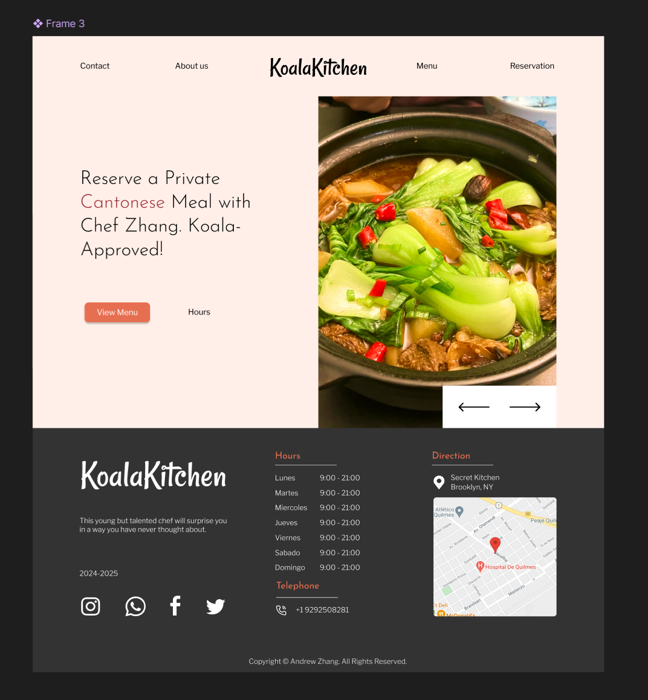
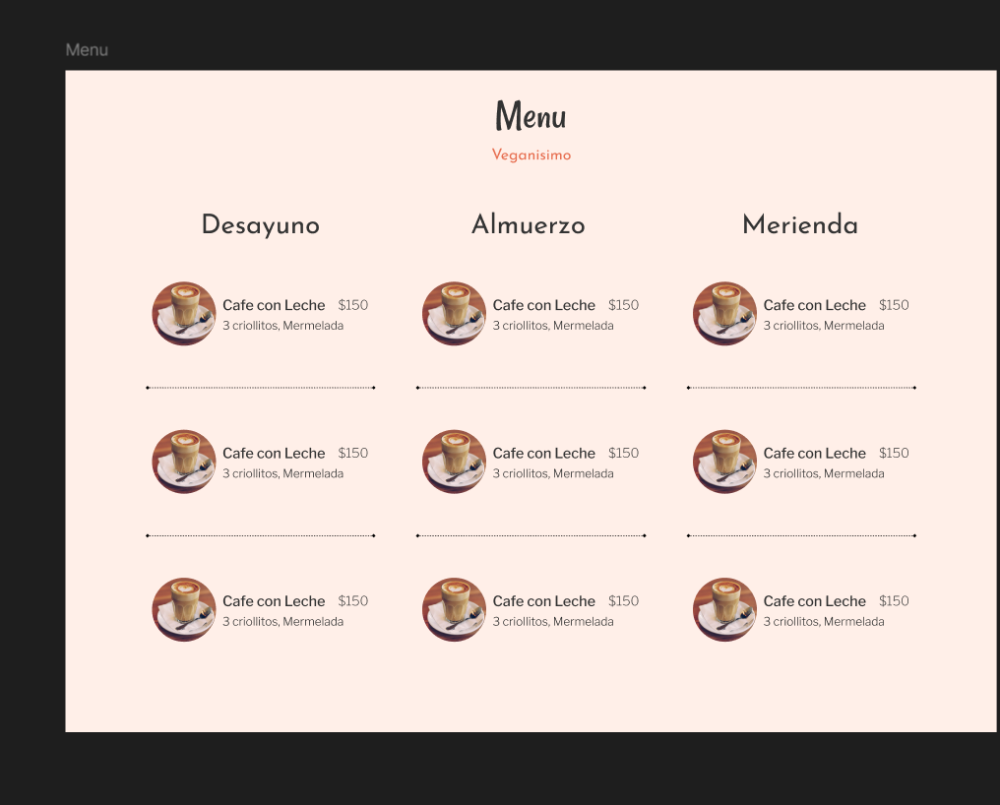
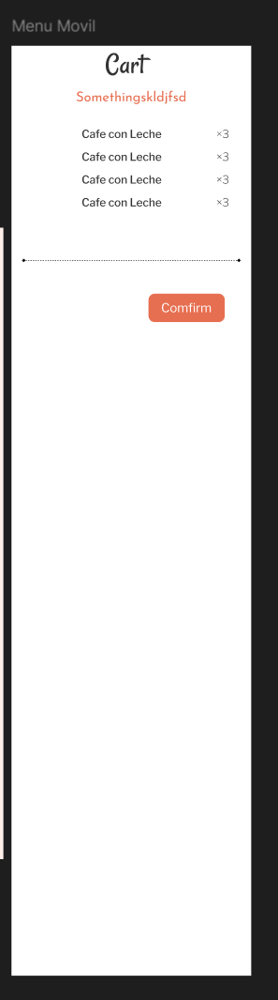

# Final Project Proposal: Koala Kitchen

## Concept / Theme

**Koala Kitchen** is an interactive meal-ordering platform designed for home cooks and food enthusiasts. The website allow users to browse and order custom meals, after which the system generates a detailed grocery list for the chef to prepare the dishes.

## Visual & UX Inspiration

- A [web design](https://www.figma.com/community/file/1077384985779045508) I used as a reference of my page
- [A Cantonese restaurant website](https://www.augustgatheringsny.com/)

## Skills Set

- HTML/CSS
  - HTML form for sending grocery list
  - Dynamic list for displaying grocery list (populated via JS)
  - Flexbox/Grid
  - Animations/Transitions
- JS
  - DOM Manipulation
  - Event Listeners
  - Arrays
  - Objects
  - Local Storage for saving order temporarily
- React
  - Components for reusable elements
  - Dynamic Rendering

## Visual Plan

### Homepage

### Menu

### Shopping Cart (floating window)

