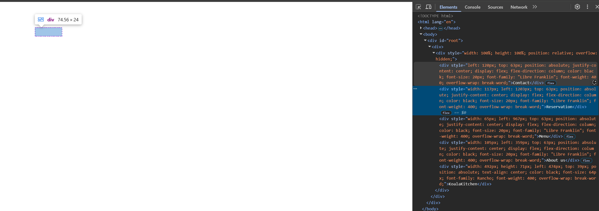
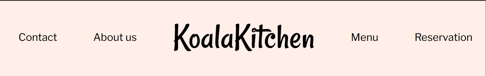
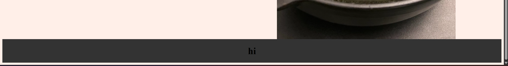
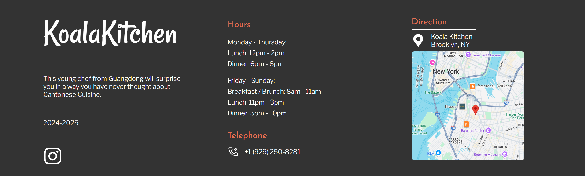
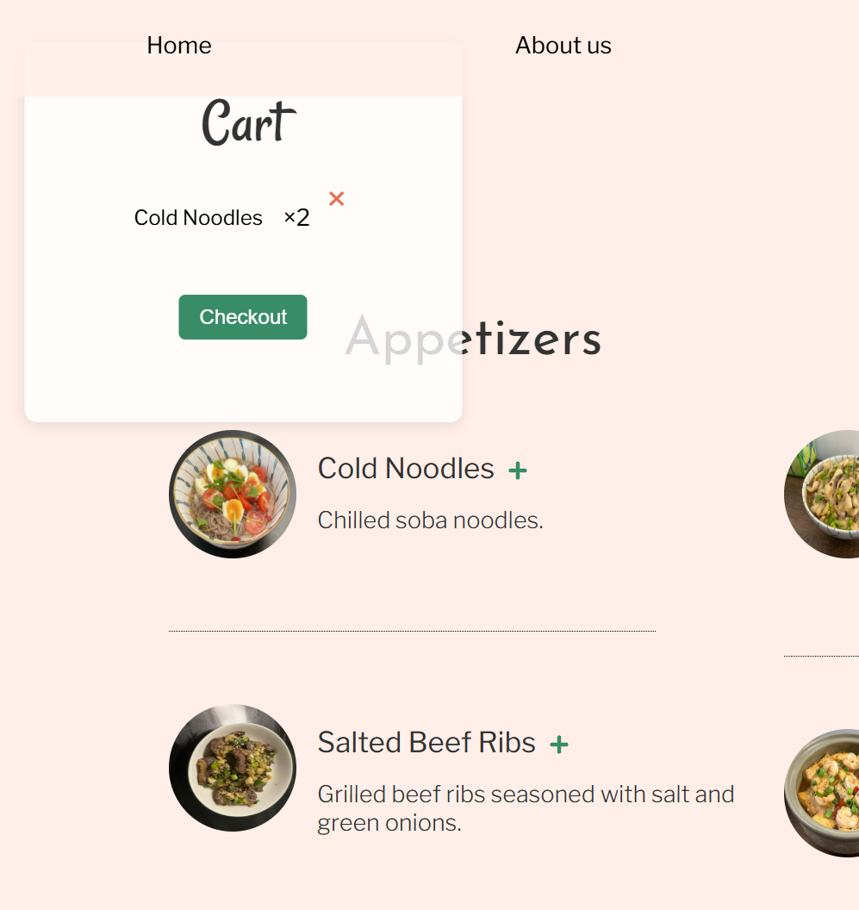
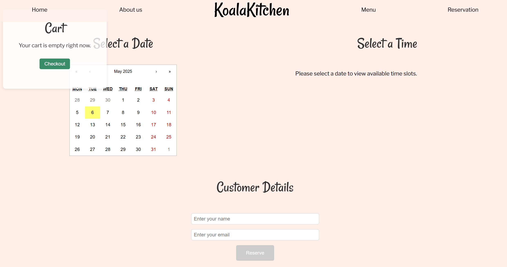

# KoalaKitchen

## Design

Ask my friend Lim to make a logo. (no use yet)


Find a good [template](https://www.figma.com/community/file/1077384985779045508) on Figma Community.
Modify base on the template. Here is a [link](https://www.figma.com/design/rRASUlkOFE9ZfSy6c7Wwjr/Koala-Kitchen?node-id=1-2&t=Nh3uRBLWCjXMyMSR-1) to my figma project.

## Coding

### Create React App

Since I have already installed Node.js, I created a new React app. I used [this link](https://medium.com/@adityasrivast/reactjs-understanding-package-json-e8cdf408a3df) as a reference to update my `package.json` file

```bash
npx create-react-app koala-kitchen
npm install react-scripts
```

```json
{
  "name": "koala-kitchen",
  "version": "0.1.0",
  "scripts": {
    "start": "react-scripts start",
    "build": "react-scripts build",
    "test": "react-scripts test",
    "eject": "react-scripts eject"
  },
  "private": true,
  "dependencies": {
    "react": "^18.2.0",
    "react-dom": "^18.2.0",
    "react-scripts": "5.0.1"
  },
  "browserslist": {
    "production": [">0.2%", "not dead", "not op_mini all"],
    "development": [
      "last 1 chrome version",
      "last 1 firefox version",
      "last 1 safari version"
    ]
  }
}
```

Update compile instruction to `README.md`

I used [this link](https://www.w3schools.com/react/react_getstarted.asp) to figure out my project structure and starter code.
I used [this link](https://www.w3schools.com/react/react_render.asp) as a reference to learn how to render HTML. This is what I did in `index.js`:

```js
import React from "react";
import ReactDOM from "react-dom/client";
import App from "./App";
import "./index.css";

const root = ReactDOM.createRoot(document.getElementById("root"));
root.render(
  <React.StrictMode>
    <App />
  </React.StrictMode>
);
```

### Navigation Bar

I tried a simple navigation bar and see if the app works.

Nothing show up... But when I inspect elements, I can see those elements. I doubt that the google font hasn't properly loaded.

Okay it is not the font's problem because when I changed the google font to `Arial, sans-serif` still doesn't work


It turns out that I use `100%` for width and height, but it doesn't have a parent container, so the dependency doesn't work. I change it to relative to window size:

```js
<div
  style={{
    width: "100vw",
    height: "100vh",
    position: "relative",
    overflow: "hidden",
  }}
>
  {/*other divs*/}
</div>
```

Naming css file as `NavBar.css` doesn't work, it has to be `NavBar.module.css`. Don't know why :(

Navigation bar is done.


### Homepage

Using CSS code generated by Figma, with my own modification, homepage is done.
Used flex box, in which have two columns. The left column contains introduction and buttons, the right column contains a photo gallery (for now, it is only a static picture, will make it a gallery in the future release)

```html
<div className="{styles.homepage}">
  <div>
    {/* left side: introduction, buttons */}
    <div className="{styles.intro}">
      Reserve a Private
      <span className="{styles.highlight}">Cantonese</span> Meal with Chef
      Zhang. Koala-Approved!
    </div>
    <div className="{styles.buttonContainer}">
      <div className="{styles.menuButton}">View Menu</div>
      <div className="{styles.hoursButton}">Hours</div>
    </div>
  </div>
  {/* right side: image gallery */}
  <div className="{styles.image}"></div>
</div>
```

### Footer

Developing footer, find out that there is a default margin around elements:

Modify `index.css`:

```css
html,
body {
  background: #ffefe8;
  /* remove default margin */
  margin: 0;
  padding: 0;
}
```

Add `user-select: none` to every "Koala Kitchen" title, since when it is selected, the dark blue background doesn't look good.

In footer, three columns were used. Like the homepage, I used flex box to locate items. Footer done.


### Menu Page

I wanna add a separate menu page.

Firstly, since menu page is a separate page, I have to link the page to buttons. I follow [this link](https://www.w3schools.com/react/react_router.asp) about React router and update my `app.js`:

```js
import React from "react";
import NavBar from "./components/NavBar.js";
import Homepage from "./components/Homepage.js";
import Footer from "./components/Footer.js";
import MenuPage from "./components/MenuPage.js";
import { BrowserRouter, Routes, Route } from "react-router-dom";

function App() {
  return (
    <BrowserRouter>
      <div>
        {/* NavBar at top of the page */}
        <NavBar />

        {/* Routes to different contents */}
        <Routes>
          <Route path="/" element={<Homepage />} />
          <Route path="/menu" element={<MenuPage />} />
        </Routes>

        {/* Footer at bottom of the page */}
        <Footer />
      </div>
    </BrowserRouter>
  );
}

export default App;
```

Basically I define routes to different pages.

In `Homepage.js` and `NavBar.js`, link some buttons to the menu page:

```js
<div className={styles.buttonContainer}>
  <Link to="/menu">
    <div className={styles.menuButton}>View Menu</div>
  </Link>
  <div className={styles.hoursButton}>Hours</div>
</div>
```

Creating the menu page now. It is a three columns designs (for now), with every column display a specific type of dishes.
I used some css code from footer.

### Cart

I want to create a floating window representing the cart. When the user click on the image, the corresponding dish will be added to the card. It also has a "confirm" feature, where will output a PDF file and send it to me via email. (I want to add a server site later but for now email is replacement)

Use [this link](https://stackoverflow.com/questions/76966480/how-to-create-a-floating-widget-that-can-float-outside-of-the-website-environmen) as a reference to create a floating window.


User will be able to add dishes to the cart. The cart content is managed by local storage, so it will have a record of the dishes in the cart, even the user switch to other tabs. 

The location of the cart is also managed by local storage, so when the user switch between tabs, the relative location of the cart will remain the same, bringing a better user experience.

### Live time display


There is a live time display that detect the current time and compare to the opening hours.

### Reservation

After the user finish ordering, they can jump to the reservation page and make a reservation. After all information is filled and confirmation, an email will be sent to my account so that I will know the customers name, email, dishes they ordered, and the grocery I need to buy.