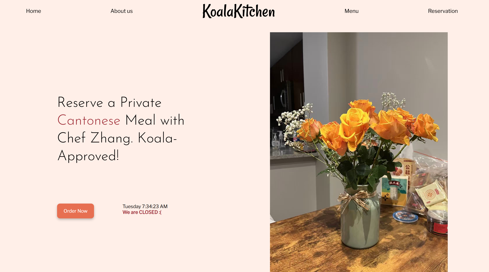

# Koala Kitchen

## Deployed Site

https://andrew-notag.github.io/Koala-Kitchen/

## What My Project Does
My website is an interactive meal-ordering platform designed for home cooks and food enthusiasts. The website allow users to browse and order custom meals, after which the system generates a detailed grocery list for the chef to prepare the dishes.

## Screenshot


## A snippet of code I figured out

How to use React router to direct to direct to different page.
The reference I used is [this link](https://www.w3schools.com/react/react_router.asp).

```js
import React from "react";
import NavBar from "./components/NavBar.js";
import Homepage from "./components/Homepage.js";
import Footer from "./components/Footer.js";
import MenuPage from "./components/MenuPage.js";
import { BrowserRouter, Routes, Route } from "react-router-dom";

function App() {
  return (
    <BrowserRouter>
      <div>
        {/* NavBar at top of the page */}
        <NavBar />

        {/* Routes to different contents */}
        <Routes>
          <Route path="/" element={<Homepage />} />
          <Route path="/menu" element={<MenuPage />} />
        </Routes>

        {/* Footer at bottom of the page */}
        <Footer />
      </div>
    </BrowserRouter>
  );
}

export default App;
```

To see more notes, go to `KoalaKitchen.md`