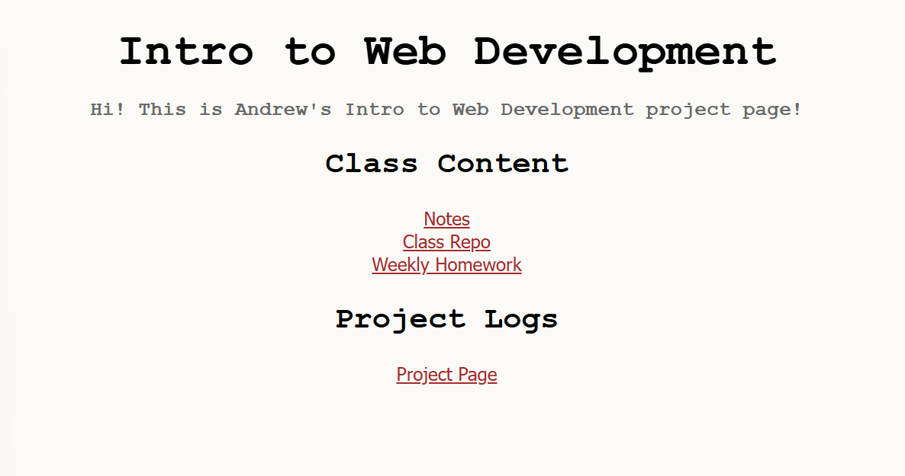
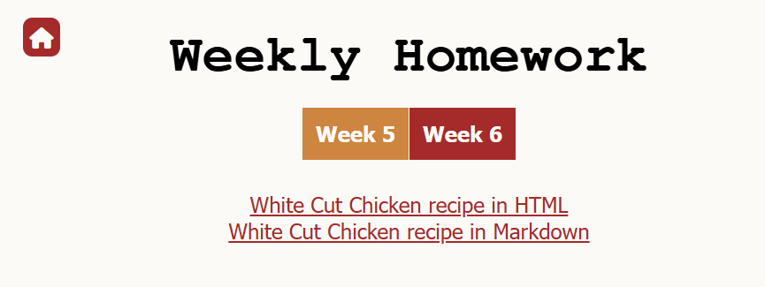

# Project Page

## Home Page



- Links highlight when hover

## Markdown Theme


_.md files will render using a remote GitHub page theme_

### Solution

Add `_config.yml` to the root directory. It is a configuration file that define setting of the website.

```yaml
remote_theme: pages-themes/dinky@v0.2.0 # I used dinky theme
plugins:
  - jekyll-remote-theme
  - "*.md" # render all .md file in all subdirectory
```

Make sure add a header to all .md files

```markdown
---
layout: default
title: Project Page Log
---
```

When include a link to .md file, change the type of file to .html. For example, if I want to include a link to `Notes_Web_Dev.md`, I wrote:

```html
<a href="Notes_Web_Dev.html" target="_blank">Notes</a>
```

## Navigation Bar



- back to homepage button
- current page tag will be highlighted using a different color, other page tag have the same color
- change color when hover (navigation button and homepage button)

### Solution

To use icon:

```html
<script
  src="https://kit.fontawesome.com/6104c18047.js"
  crossorigin="anonymous"
></script>
```

I want to dynamically detect which page I am on, so I use _jQuery_ library and write my navigation bar code in a separate html file.

```html
<script src="https://code.jquery.com/jquery-2.1.4.min.js"></script>
<script>
  $(function () {
    // load code for navigation bar
    $("#nav-placeholder").load("../../nav_bar.html", function () {
      $(".nav_a").each(function () {
        // remove all back slash (/)
        var link_href = this.href.replace(/\/$/, "");
        var window_href = window.location.href.replace(/\/$/, "");
        if (link_href === window_href) {
          $(this).addClass("active");
        }
      });
    });
  });
</script>
```

At first, the code can not correctly detect the current active page. Using console logs, I found out that `this.href` and `window.location.href` return address is one back slash different at the end. So I modified the code to compare the two address after remove all the back slashes.

Finally, add appropriate CSS to `.nav_a.active`.

## Contact Form

I used [this tutorial](https://formcarry.com/blog/how-to-create-a-simple-html-contact-form/) as a reference to build the contact form.

Try to send a test email, failed. The browser displays `405 Not Allowed`
